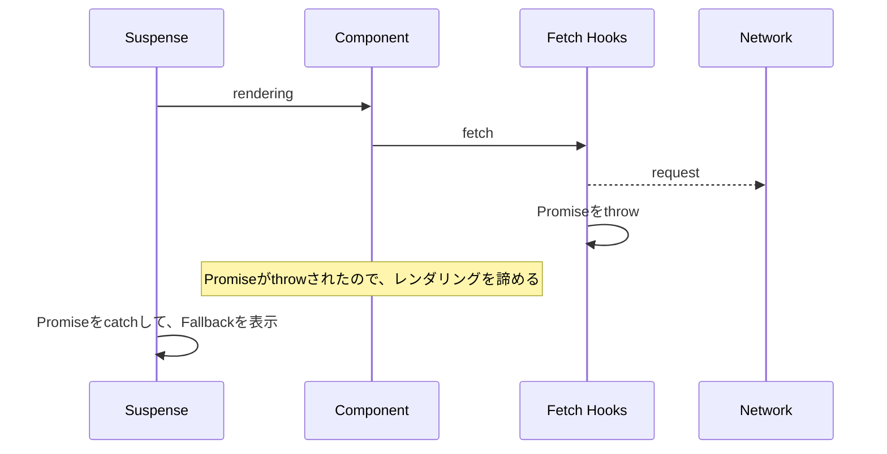
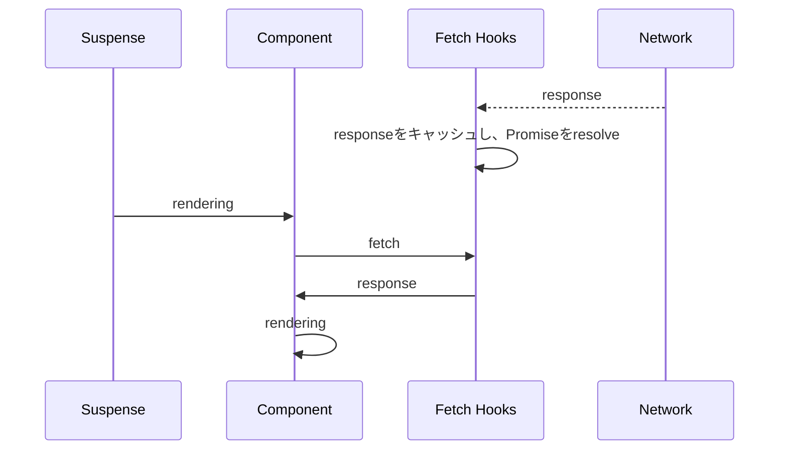

---
# try also 'default' to start simple
theme: light-icons
class: 'text-center'
# https://sli.dev/custom/highlighters.html
highlighter: shiki
# show line numbers in code blocks
lineNumbers: false
# some information about the slides, markdown enabled
info: |
  ## Slidev Starter Template
  Presentation slides for developers.

  Learn more at [Sli.dev](https://sli.dev)
# persist drawings in exports and build
drawings:
  persist: false

layout: center-image
---

# React 18

React 18の新機能について、デモを交えて紹介します。

<style>
  h1 { font-size: 2.5rem }
</style>

---
layout: image-right
---

# React 18の新機能

- Automatic Batching
- Suspense
- Transitions
- Other

---

## Automatic Batching

`Batching`とは複数のステート更新をグループ化し、パフォーマンスを向上させること。

React 17以前も`onClick`といったReactのイベントハンドラ内では`Batching`を適用していた。

```ts
const handleClick = () => {
  setCount(v => v + 1);
  setFlag(v => !v);
}
```

```html
<button onClick={handleClick}>update</button>
```

このようなケースでは、`handleClick`内の処理がすべて完了したタイミングで再レンダリングが走る。

---

## Automatic Batching

ただし、Reactのイベントハンドラ外（promise / setTimeout / その他イベント）には`Batching`が適用されていなかった。

```ts
const handleClick = () => {
  setTimeout(() => {
    setCount(v => v + 1);
    // ここで再レンダリングが走る.
    setFlag(v => !v);
    // ここでも再レンダリングが走る.
  }, 100);
}
```

---

## Automatic Batching

React 18では、Reactのイベントハンドラ外（promise / setTimeout / その他イベント）にも適用されるように。

```ts
const handleClick = () => {
  setTimeout(() => {
    setCount(v => v + 1);
    setFlag(v => !v);
    // setTimeout内の処理完了後に、再レンダリングが走る.
    // ※厳密にはReact独自のタイミングを図ってそう.
  }, 100);
}
```

---

## Automatic Batching

React 18環境で、`Automatic Batching`を適用しない手段（**flushSync**）も提供されている。

```ts
const handleClick = () => {
  setTimeout(() => {
    // flushSync内の処理が完了したら再レンダリングが走る.
    flushSync(() => setCount(v => v + 1));
    // flushSync内の処理が完了したら再レンダリングが走る.
    flushSync(() => setFlag(v => !v));
  }, 100);
}
```

---

## Suspense

UIのロード状態を宣言的に記述できる。

React 17までのローディング実装はこんな感じ。

```ts
const Component: React.FC = () => {
  const {data, isLoading} = useUserData();

  // データのフェッチ中はローディングコンポーネントをレンダリング.
  if (isLoading) {
    return <Loading />;
  }

  // データのフェッチが完了したら、そのデータを表示.
  return <p>{data}</p>;
}
```

---

## Suspense

React 18のSuspense機能を使った場合のローディング実装。

```ts
const Component: React.FC = () => {
  const {data} = useUserData();

  return <p>{data}</p>;
}
```

```ts
const Screen: React.FC = () => {
  return (
    <Suspense fallback={<Loading />}>
      <Component />
    </Suspense>
  );
}
```

- Componentはデータ表示のみに専念できる
- それにより、役割（責務）の棲み分け／細分化が可能に

---

## Suspense

Suspenseの仕組みは、`Promise`を`throw`することで実現している。



---

## Suspense

`Promise`が解決すると、再度レンダリングされる。



---

## Transitions

ステートの更新について、すぐに反映するかしないかをReactに伝える手段。

`startTransition`経由でのステート更新は、すぐに反映しなくてもOKと判断され、ユーザー操作が優先される。

---

## Other

その他、変更点。

- StrictModeの動作変更

  コンポーネントがマウントされるタイミングで、必ずアンマウントと再マウントされるようになる。


- React.FCのchildren廃止

  React 17までは暗黙的に定義されていた`children`が廃止。

  ```ts
  type Props = {
    // 明示的に定義.
    children: React.ReactNode;
  }

  const Component: React.FC<Props> = ({children}) => {
    return <>{children}</>;
  }
  ```

---

## Other

React NativeのReact 18対応状況。

- 2022年6月末にリリースされた、React Native 0.69でサポートされた
- ただし、Fabricを含む`New Architecture`に移行する必要がある
- Fabricは段階的な利用ができず、すべてのコンポーネントライブラリがFabric対応していないと使えない

人気のあるライブラリのNew Architecture対応状況

```text
# https://reactnative.dev/blog/2022/06/16/resources-migrating-your-react-native-library-to-the-new-architecture#migration-status-of-popular-libraries
react-native-gesture-handler: ✅ Migrated
react-native-navigation: 🏃‍♂️ Ongoing
react-native-pager-view: 🏃‍♂️ Ongoing
react-native-reanimated: ✅ Migrated. In the process of testing and profiling for performances
react-native-screens: 🏃‍♂️ Ongoing
react-native-slider: 🎬 Started
react-native-template-new-architecture: ✅ Migrated. Gradually adopting/testing more companion Libraries
react-native-template-typescript: ✅ Migrated
react-native-webview: 🎬 Started
```

現場で使うには、もう少しかかりそう？
